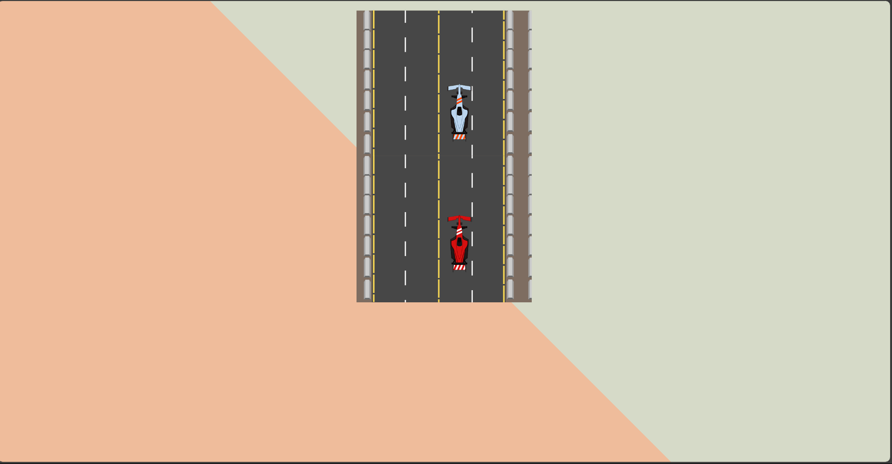
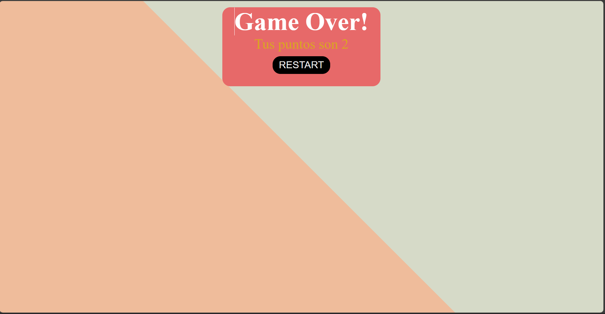
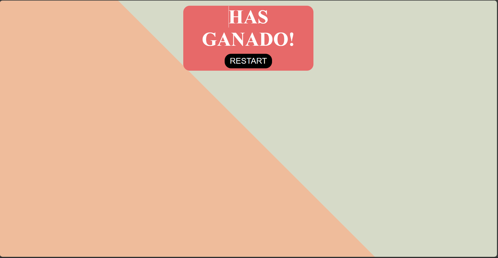

# CAR COLLISION GAME 
## MADE BY Christian Mamani (crmch)

El videojuego es muy simple, cosiste en esquivar tantas veces como puedas a un coche que viene de frente. 
En el momento en el que chocas has perdido.
Ganas cuando consigues superar las 27 vueltas.   
La forma de mover el coche es con las flechas de dirección: arriba, abajo, izquierda y derecha.
 
 

 
 
Cuando pierdes la partida apaarece la pantalla de Game Over:
 
 

 
 
Cuando ganas la partida aparece la pantalla de Has Ganado!
 
 

 
 
Tanto en la pantalla de Has Ganado! como en la de Game Over tienes la opción de volver a jugar al presionar el botón RESTART.